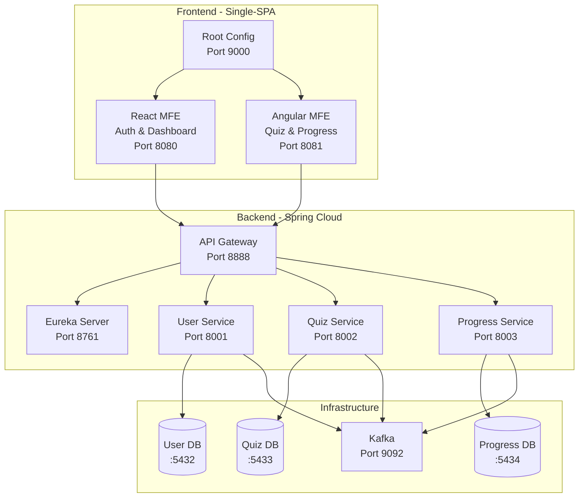
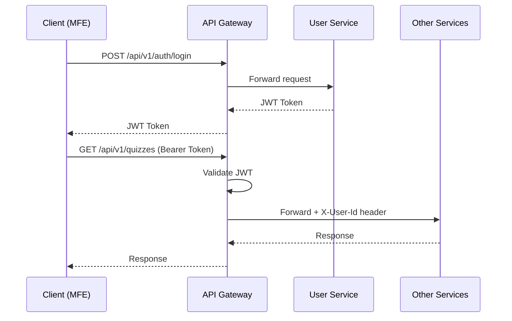
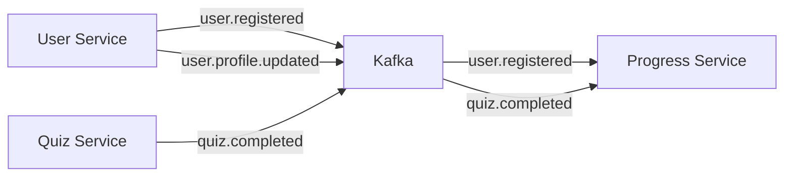
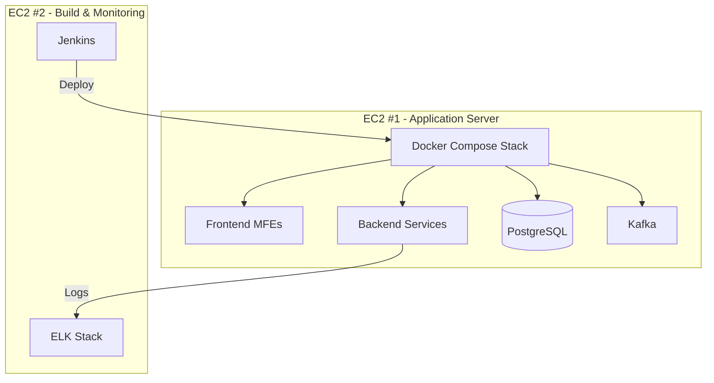

# Pilot Quiz Platform - Architecture

## System Overview

The Pilot Quiz Platform is an enterprise-grade application for pilots preparing for FAA rating exams. It follows a microservice backend with micro-frontend architecture.

---

## Architecture Diagram

---

## Service Descriptions

| Service | Port | Purpose |
|---------|------|---------|
| **Eureka Server** | 8761 | Service discovery and registration |
| **API Gateway** | 8888 | Request routing, JWT validation, CORS |
| **User Service** | 8001 | Authentication, user profiles |
| **Quiz Service** | 8002 | Questions, quizzes, categories |
| **Progress Service** | 8003 | Attempts, scores, analytics |

---

## Technology Stack

| Layer | Technology | Version |
|-------|------------|---------|
| Frontend Shell | Single-SPA | 5.x |
| React MFE | React + Vite | 18.x |
| Angular MFE | Angular | 17.x |
| API Gateway | Spring Cloud Gateway | 2023.0.0 |
| Microservices | Spring Boot | 3.2.1 |
| Database | PostgreSQL | 15 |
| Messaging | Apache Kafka | 7.5.0 |
| CI/CD | Jenkins | Latest |
| Monitoring | ELK Stack | 8.x |

---

## Security Architecture

**Key Security Features:**

- JWT-based stateless authentication
- Token validation at API Gateway
- Role-based access control (ROLE_USER, ROLE_ADMIN)
- CORS configured for MFE origins

---

## Event-Driven Communication

**Kafka Topics:**

- `user.registered` - Triggers progress initialization
- `user.profile.updated` - Syncs profile changes
- `quiz.completed` - Updates progress tracking

---

## Deployment Architecture

---

*Generated with assistance from Gemini AI*
*Reviewed and modified by Richard Hawkins*
