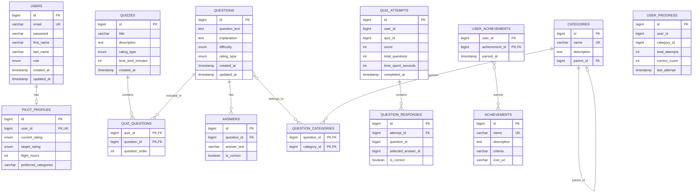

# Entity Relationship Diagram

## Overview

The Pilot Quiz Platform uses a **database-per-service** pattern with three PostgreSQL databases.

---

## Complete ERD

---

## Database Schemas by Service

### User Service Database (Port 5432)

| Table | Columns | Description |
|-------|---------|-------------|
| `users` | 7 | User authentication data |
| `pilot_profiles` | 5 | Aviation-specific user info |

**Table Count:** 2

---

### Quiz Service Database (Port 5433)

| Table | Columns | Description |
|-------|---------|-------------|
| `questions` | 7 | Quiz question content |
| `answers` | 4 | Answer options per question |
| `quizzes` | 5 | Quiz metadata |
| `quiz_questions` | 3 | Quiz-Question M:M join |
| `categories` | 4 | Topic categories |
| `question_categories` | 2 | Question-Category M:M join |

**Table Count:** 6

---

### Progress Service Database (Port 5434)

| Table | Columns | Description |
|-------|---------|-------------|
| `quiz_attempts` | 7 | Completed quiz records |
| `question_responses` | 5 | Individual question answers |
| `user_progress` | 6 | Category-level progress |
| `achievements` | 5 | Achievement definitions |
| `user_achievements` | 3 | User-Achievement M:M join |

**Table Count:** 5

---

## Normalization

All tables are normalized to **3NF**:

- 1NF: All columns contain atomic values
- 2NF: All non-key columns depend on the full primary key
- 3NF: No transitive dependencies between non-key columns

---

## Many-to-Many Relationships

| Relationship | Join Table | Description |
|--------------|------------|-------------|
| Quiz ↔ Question | `quiz_questions` | Questions can appear in multiple quizzes |
| Question ↔ Category | `question_categories` | Questions can have multiple categories |
| User ↔ Achievement | `user_achievements` | Users can earn multiple achievements |

**Total M:M Relationships:** 3 (exceeds P3 requirement of 2)

---

*Generated with assistance from Gemini AI*
*Reviewed and modified by Richard Hawkins*
