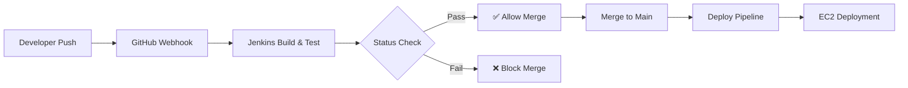

# Jenkins + GitHub CI/CD Integration Guide

This guide walks you through setting up Jenkins as a build gate for GitHub pull requests, with automatic deployment on merge to main.

---

## Overview



### What This Setup Achieves

| Behavior | Description |
|----------|-------------|
| **Auto-trigger builds** | Every push to any branch triggers Jenkins |
| **PR Status Checks** | Jenkins reports pass/fail to GitHub |
| **Merge Protection** | PRs blocked until Jenkins passes |
| **Auto-deploy on merge** | Merging to `main` triggers deployment |

---

## Prerequisites

- [ ] Jenkins instance (local or EC2) accessible via public URL
- [ ] GitHub repository with admin access
- [ ] Jenkins plugins (installed during setup)
- [ ] GitHub Personal Access Token

---

## Part 1: Prepare Jenkins

### Step 1.1: Install Required Plugins

Go to **Manage Jenkins → Plugins → Available plugins**

Install:

- **GitHub Integration Plugin** - Connects Jenkins to GitHub
- **GitHub Branch Source Plugin** - For multibranch pipelines
- **Pipeline: GitHub Notify** - Posts build status back to GitHub

Restart Jenkins after installation.

### Step 1.2: Create GitHub Personal Access Token

1. Go to GitHub: **Settings → Developer Settings → Personal Access Tokens → Tokens (classic)**
2. Click **Generate new token (classic)**
3. Name: `jenkins-integration`
4. Select scopes:
   - ✅ `repo` (Full control of private repositories)
   - ✅ `admin:repo_hook` (Manage webhooks)
5. Click **Generate token**
6. **Copy the token immediately** (you won't see it again)

### Step 1.3: Add GitHub Credentials to Jenkins

1. Go to **Manage Jenkins → Credentials → System → Global credentials**
2. Click **Add Credentials**
3. Configure:
   - **Kind**: Secret text
   - **Secret**: Paste your GitHub token
   - **ID**: `github-token`
   - **Description**: GitHub Personal Access Token
4. Save

### Step 1.4: Configure GitHub Server in Jenkins

1. Go to **Manage Jenkins → System**
2. Scroll to **GitHub Servers → Add GitHub Server**
3. Configure:
   - **Name**: `GitHub`
   - **API URL**: `https://api.github.com`
   - **Credentials**: Select your `github-token`
4. Click **Test connection** - should show "Credentials verified"
5. Save

---

## Part 2: Connect GitHub to Jenkins

### Step 2.1: Create Webhook in GitHub

1. Go to your repository: **Settings → Webhooks → Add webhook**
2. Configure:

   | Field | Value |
   |-------|-------|
   | Payload URL | `http://<your-jenkins-url>/github-webhook/` |
   | Content type | `application/json` |
   | Secret | (optional but recommended) |

3. Select events:
   - ✅ **Push events**
   - ✅ **Pull requests**
4. Click **Add webhook**

> [!IMPORTANT]
> **For EC2 Jenkins**: Your Jenkins must be publicly accessible. Configure your EC2 Security Group to allow inbound traffic on port 8080 (or your Jenkins port).

### Step 2.2: Verify Webhook

1. Push a small change to your repository
2. Check GitHub: **Settings → Webhooks** - should show ✅ green checkmark
3. Check Jenkins: Your pipeline should trigger

---

## Part 3: Update Jenkinsfiles to Report Status

### Step 3.1: Update Orchestrator Jenkinsfile

Add `githubNotify` steps to report build status back to GitHub:

```groovy
pipeline {
    agent any
    
    stages {
        stage('Checkout') {
            steps {
                checkout scm
                // Notify GitHub: Build started
                script {
                    githubNotify context: 'ci/jenkins/pilotquiz',
                                 status: 'PENDING',
                                 description: 'Build in progress...'
                }
            }
        }
        
        stage('Detect Changes') {
            // ... existing code ...
        }
        
        stage('Build Services') {
            // ... existing code ...
        }
    }
    
    post {
        success {
            githubNotify context: 'ci/jenkins/pilotquiz',
                         status: 'SUCCESS',
                         description: 'All builds passed!'
        }
        failure {
            githubNotify context: 'ci/jenkins/pilotquiz',
                         status: 'FAILURE',
                         description: 'Build failed - check logs'
        }
    }
}
```

> [!NOTE]
> The `context` string (e.g., `ci/jenkins/pilotquiz`) becomes the name of the status check in GitHub. Use a consistent, descriptive name.

---

## Part 4: Enable Branch Protection in GitHub

### Step 4.1: Configure Branch Protection Rule

1. Go to repository: **Settings → Branches**
2. Click **Add branch protection rule**
3. Configure:

| Setting | Value |
|---------|-------|
| **Branch name pattern** | `main` |
| **Require a pull request before merging** | ✅ Enabled |
| **Require approvals** | 1+ (optional) |
| **Require status checks to pass** | ✅ Enabled |
| **Status checks that are required** | Search: `ci/jenkins/pilotquiz` |
| **Require branches to be up to date** | ✅ Enabled |
| **Do not allow bypassing settings** | ✅ Recommended |

1. Click **Save changes**

> [!CAUTION]
> The status check name must match the `context` in your Jenkinsfile exactly. Run a build first so GitHub can discover the status check name.

---

## Part 5: Add Deployment Stage

### Step 5.1: Update Jenkinsfile with Deploy Stage

Add a conditional deploy stage that only runs on `main`:

```groovy
pipeline {
    agent any
    
    stages {
        // ... build stages ...
        
        stage('Deploy to Production') {
            when {
                branch 'main'
            }
            steps {
                echo 'Deploying to EC2...'
                
                sshagent(['ec2-ssh-key']) {
                    sh '''
                        ssh -o StrictHostKeyChecking=no ubuntu@your-ec2-ip << 'EOF'
                            cd /opt/pilotquiz
                            docker-compose pull
                            docker-compose up -d
                        EOF
                    '''
                }
            }
        }
    }
}
```

### Step 5.2: Set Up SSH Credentials for EC2

1. **Manage Jenkins → Credentials → Add Credentials**
2. **Kind**: SSH Username with private key
3. **ID**: `ec2-ssh-key`
4. **Username**: `ubuntu` (or your EC2 user)
5. **Private Key**: Paste your EC2 `.pem` file contents

---

## Complete Workflow

```
1. Developer creates feature branch
   └── Pushes code
       └── GitHub webhook triggers Jenkins
           └── Jenkins runs build + tests
               └── Jenkins posts status to GitHub

2. Developer opens Pull Request
   └── GitHub shows status check (✅ or ❌)
       └── If ❌ → Merge blocked
       └── If ✅ → Merge allowed

3. PR approved and merged to main
   └── GitHub webhook triggers Jenkins
       └── Jenkins detects main branch
           └── Runs deploy stage
               └── Updates EC2 via SSH
```

---

## Testing the Setup

### Test 1: Push Triggers Build

1. Push to a feature branch
2. Verify Jenkins pipeline starts
3. Check GitHub commit shows pending status

### Test 2: Status Reports Back

1. Let build complete
2. Check GitHub shows ✅ or ❌

### Test 3: PR Protection Works

1. Open a PR with a failing test
2. Verify merge button is disabled
3. Fix the test and push
4. Verify merge button enables

### Test 4: Deploy on Merge

1. Merge a passing PR to main
2. Verify deploy stage runs
3. Check EC2 for updated containers

---

## Troubleshooting

| Issue | Solution |
|-------|----------|
| Webhook shows ❌ | Check Jenkins URL is accessible from internet |
| Status not appearing | Verify `githubNotify` context matches branch protection rule |
| Deploy fails | Check SSH key permissions and EC2 security group |
| Build not triggering | Verify webhook events include Push and Pull Request |

---

## Required Changes Summary

1. **Jenkins**: Install plugins, configure GitHub server
2. **GitHub**: Create webhook, add branch protection
3. **Jenkinsfile**: Add `githubNotify` post steps
4. **Optional**: Add deploy stage for main branch
